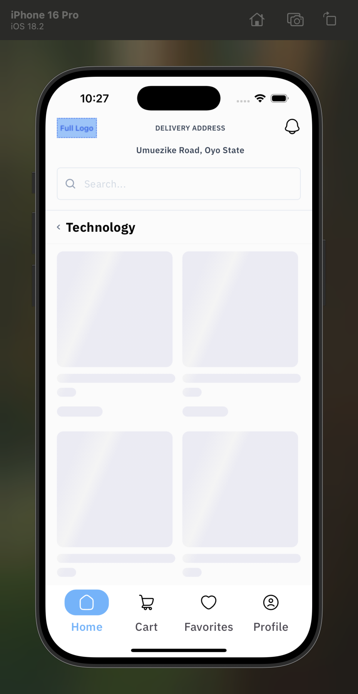
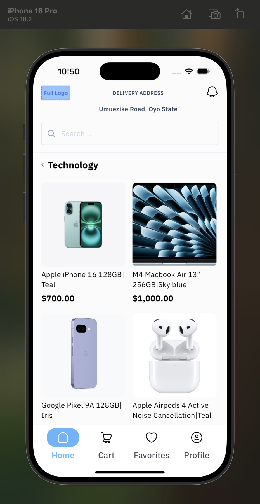
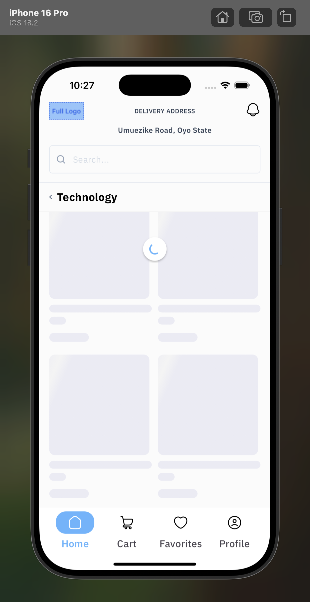
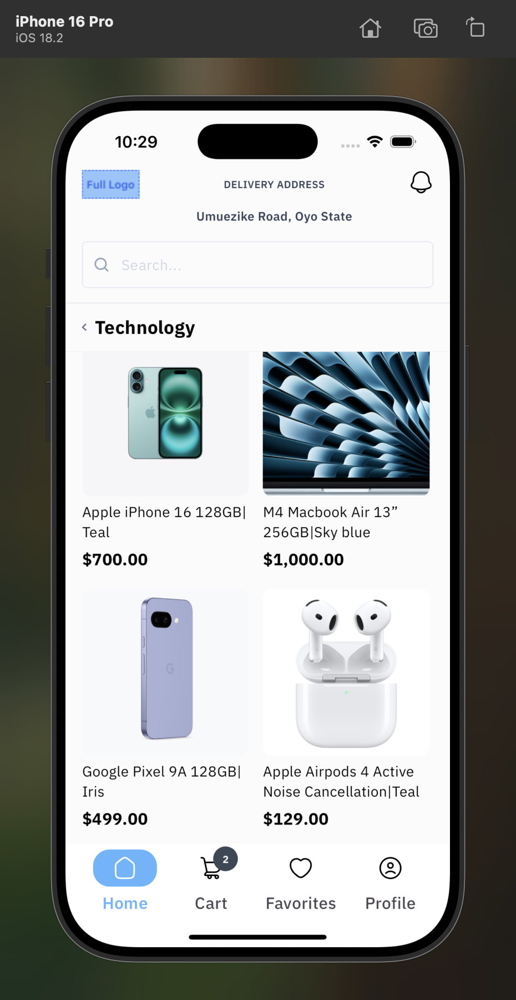
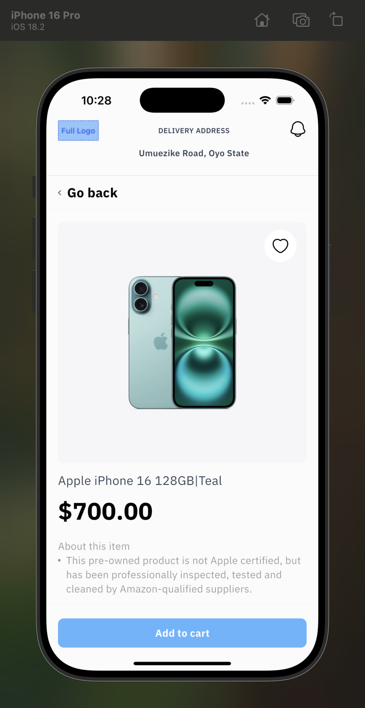
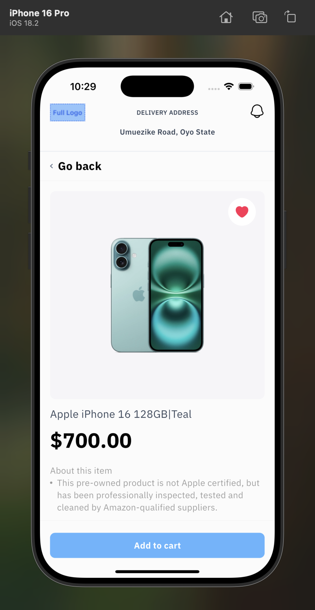
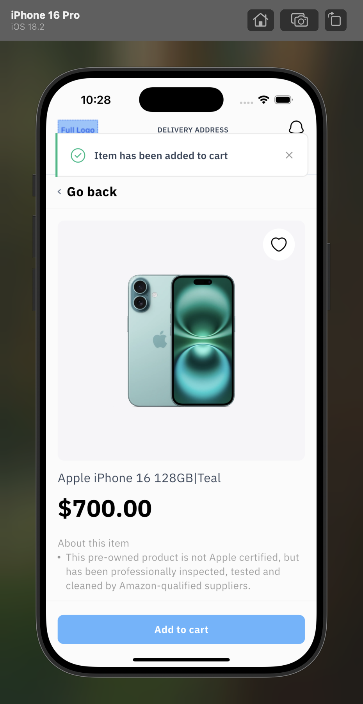
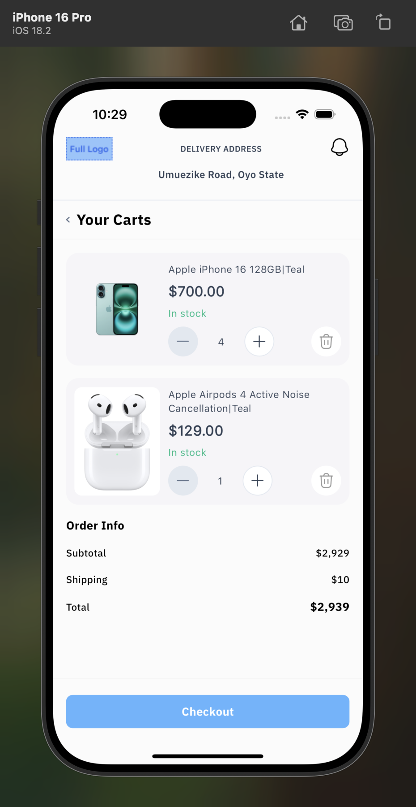
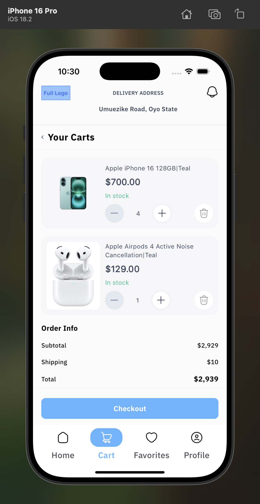

# 🛒 Minimart

Minimart is a Flutter project for managing a minimal grocery shopping experience with flavor-based environments.

---

## 🚀 Getting Started

Follow these steps to set up and run the project locally.

### 1. Clone the Repository

```sh
# Copy to your machine
$ git clone git@github.com:adedrey/minimart.git
$ cd minimart

# Install Dependencies
$ flutter pub get

# Generate Code
$ dart run build_runner build

# Run the App 

# Development
$ flutter run --flavor development --debug -t lib/main_development.dart

# Staging
$ flutter run --flavor staging --target lib/main_staging.dart

# Production
$ flutter run --flavor production --target lib/main_production.dart
```

### Screenshots

🏠 Home Screen






🏠 Product Detail Screen





🛒 Cart Screen


